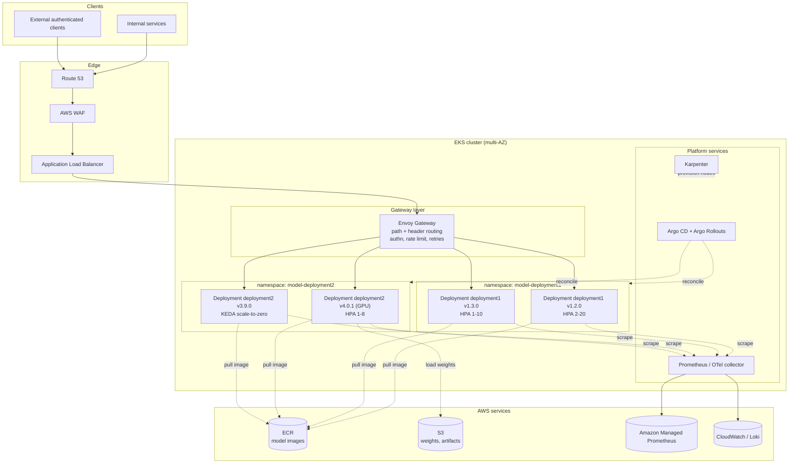
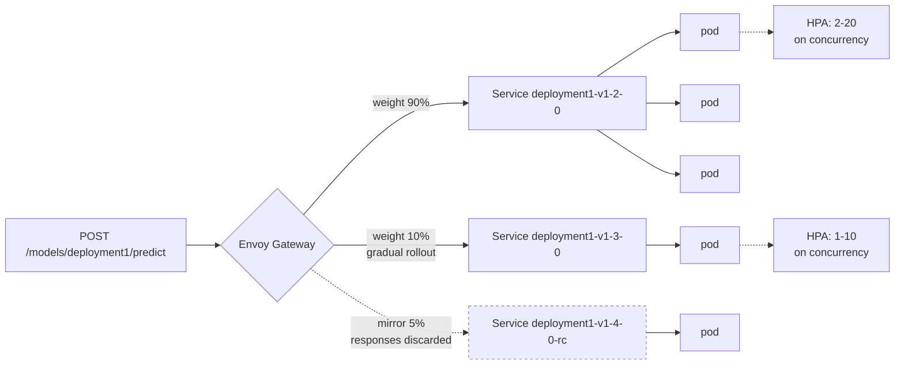
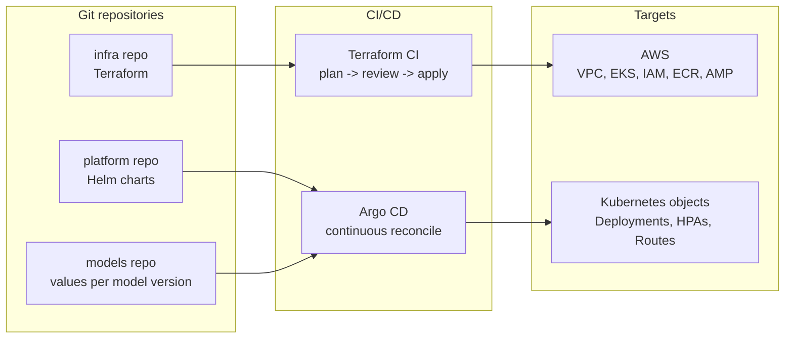
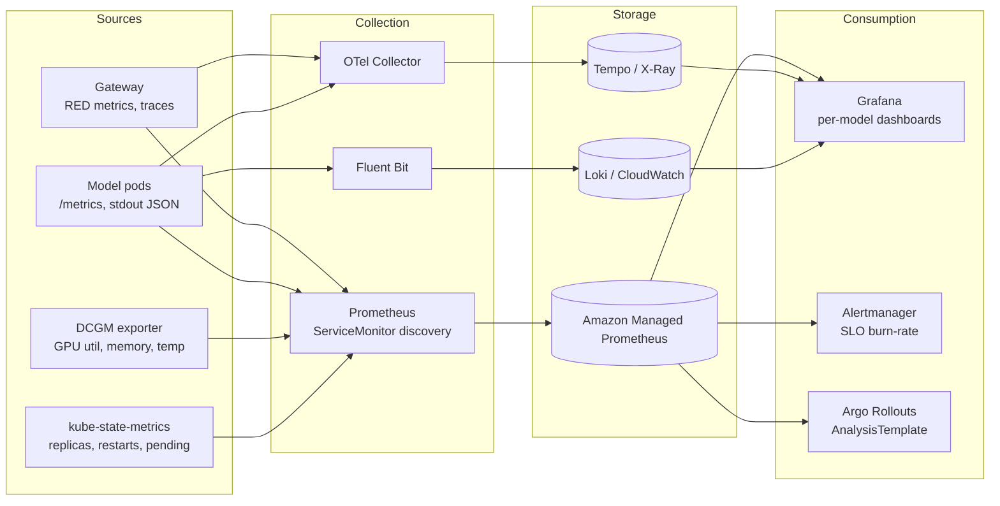
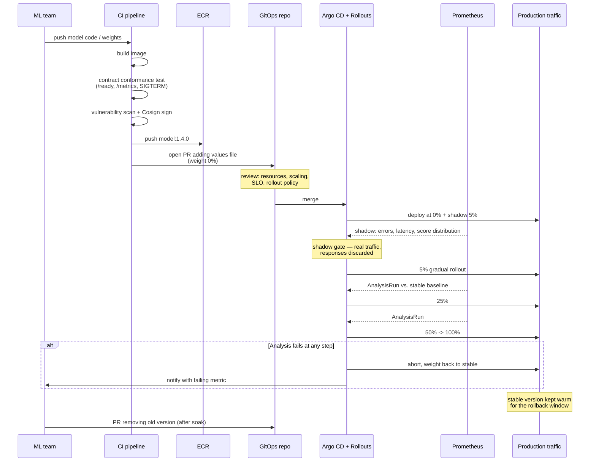

# Scalable Multi-Model Inference Platform — Design

A design for a platform that hosts many ML models, and many versions of each
model, as independently scalable HTTP services on AWS.

The guiding idea: **the unit of deployment, scaling, routing,
observability and rollback is a single `(model, version)` pair.** Everything
else in the design follows from treating that pair as a first-class object.

**Contents:** [1. Scope](#1-problem-scope-and-assumptions) ·
[2. Image contract](#2-the-model-image-contract) ·
[3. Architecture & resiliency](#3-architecture) ·
[4. Infrastructure toolkit](#4-infrastructure-toolkit) ·
[5. Monitoring & observability](#5-monitoring-and-observability) ·
[6. Operations](#6-operations) ·
[7. Trade-offs](#7-trade-offs-and-what-id-do-next)

---

## 1. Problem, scope and assumptions

### Given

- The ML team ships models as **Docker images**.
- Each image serves inference over **HTTP at predefined endpoints**.
- Each image serves **one model, one version**.
- Many models and many versions of the same model run **simultaneously**.
- Each must **scale independently** with its own demand.

### Assumptions

I'm stating these explicitly because they drive the design; a different answer
to any of them would change specific choices, not the overall shape.

| # | Assumption | Why it matters |
|---|---|---|
| A1 | Synchronous, request/response inference (not batch scoring jobs) | Drives HPA-on-concurrency rather than queue workers |
| A2 | Latency targets in the tens-to-hundreds of milliseconds, not microseconds | Allows a proxy hop; rules out kernel-bypass/sidecar-free designs |
| A3 | Mixed CPU and GPU models | Requires heterogeneous node pools and GPU-aware scheduling |
| A4 | Tens of models, low hundreds of live versions | Fits comfortably in one cluster per environment; sharding is a later concern |
| A5 | Model weights are baked into the image, or pulled at startup from S3 | Affects image size, cold-start time, and the readiness contract |
| A6 | Callers are internal services and/or authenticated external clients | Auth happens at the edge, not in every model container |
| A7 | The ML team owns model correctness; the platform team owns availability | Defines the contract in §2 as the hard boundary |


---

## 2. The model image contract

This is the most important part of the design. Everything downstream —
autoscaling, health checking, routing, dashboards, — depends on every
model image behaving the same way. Without a contract, the platform has to
special-case each model, and it stops being a platform.

The ML team publishes an image that satisfies:

**Serving**

- Listens on HTTP port `8080`.
- Serves inference at `POST /predict` (or whatever the org standardises on);
  the platform does not care about the request/response schema.
- stops accepting new requests, drains in-flight ones,
  exits within `terminationGracePeriodSeconds`.

**Health**

- `GET /health` — liveness. Cheap. Fails only if the process is wedged.
- `GET /ready` — readiness. Returns 200 **only** once weights are loaded and
  the model can serve a real request. This is what makes zero-downtime rollout
  possible, and it is the endpoint most commonly implemented wrongly (returning
  200 immediately at process start).

**Telemetry**

- `GET /metrics` — Prometheus format. Must include request count, error count,
  and latency histogram. May include model-specific signals (input feature
  statistics, output distribution, batch size, token counts).
- Logs as JSON, as inbound `X-Request-Id`.

**Metadata** (OCI image labels, read by CI and by policy checks)

- `ai.model.name`, `ai.model.version`, `ai.model.framework`
- `ai.model.accelerator` — `cpu` | `gpu`
- `ai.model.resources.{cpu,memory,gpu}` — the ML team's requested baseline

**Behaviour**

- Stateless between requests. Any cache is process-local and disposable.
- No writes to the container filesystem outside `/tmp` (runs read-only rootfs).
- Runs as a non-root user.

A conformance test in CI hits a freshly built image with these endpoints and
fails the build if any are missing. **This single check is what keeps operational
cost flat as the number of models grows.**

---

## 3. Architecture

### 3.1 High level



### 3.2 Routing: one address per model version

Every version gets a stable, predictable URL. The gateway routes purely on
path, so adding a version is a config change, never a code change.

```
POST /models/deployment1/v1.2.0/predict   -> Service deployment1-v1-2-0
POST /models/deployment1/v1.3.0/predict   -> Service deployment1-v1-3-0
POST /models/deployment1/predict          -> alias, weighted across live versions
```

The unversioned alias is what most callers use. It is the single control point
for canaries and rollbacks: shifting traffic is a change to one weight map,
and callers never change their URL.



Pinned version URLs remain available throughout, so a caller that needs
determinism (a reproducible evaluation run, a regulated workflow) can opt out
of the weighted alias entirely.

### 3.3 Why a Deployment per version

Each `(model, version)` is its own Kubernetes Deployment, Service, HPA and
PodDisruptionBudget, rendered from one shared Helm chart.

This gives, essentially for free:

- **Independent scaling** — the explicit requirement. A spike on `deployment2 v4`
  does not provision capacity for `deployment1 v1`.
- **Independent failure domains** — a model that leaks memory and OOMs takes
  down only its own pods.
- **Independent resource shapes** — a GPU model and a small CPU model do not
  have to agree on a pod spec.
- **Trivial rollback** — the old version's Deployment is still running and
  still healthy; rollback is a traffic weight change, not a redeploy.

The cost is object count and a baseline pod per idle version. §3.5 and §7
address both.

### 3.4 Compute: node pools and Karpenter

Nodes are provisioned by **Karpenter** rather than fixed autoscaling groups,
because model pods have wildly heterogeneous shapes and Karpenter bin-packs to
the instance type that actually fits the pending pod.

| Pool | Purpose | Capacity | Notes |
|---|---|---|---|
| `system` | Gateway, Argo, observability | On-demand | Small, stable, never spot |
| `cpu-serving` | CPU models | Spot with on-demand fallback | Majority of workloads |
| `gpu-serving` | GPU models | On-demand (`g5`/`g6`) | Taint `nvidia.com/gpu`, time-slicing or MIG for small models |
| `burst` | Absorbs spikes | Spot | Lower pod priority; preemptible |

Spot interruption is handled by Karpenter's interruption queue draining nodes
gracefully, combined with PodDisruptionBudgets and multi-AZ spread — the same
machinery that handles voluntary disruption.

### 3.5 Autoscaling, in three tiers

```
requests  ->  HPA        scales pods within a version   (seconds)
          ->  KEDA       scales 0<->1 for idle versions (seconds, on first request)
          ->  Karpenter  scales nodes for pending pods  (~1 minute)
```

**Pods (HPA).** Scaling on CPU is a poor proxy for load on a GPU model and a
mediocre one even for CPU models. The HPA instead targets **in-flight requests
per pod**, exported by the gateway and surfaced via Prometheus Adapter. That
metric correlates directly with queuing and therefore with latency, and it
works identically for CPU and GPU models.

**Scale to zero (KEDA).** Older versions kept alive for compatibility often see
near-zero traffic. KEDA scales those to zero and back on the first request. The
trade-off is a cold start — which is exactly why the contract in §2 requires an
honest `/ready`, and why scale-to-zero is opt-in per version rather than the
default. Latency-sensitive versions keep a warm floor of 1–2 replicas.

**Nodes (Karpenter).** Pending pods trigger node provisioning. To keep p99 cold
starts acceptable during a spike, a small over-provisioning Deployment of
low-priority pause pods holds spare capacity that real pods preempt instantly.

### 3.6 Resiliency and reliability

Reliability here is mostly about **containment**: with a hundred model versions
sharing a cluster, the dominant risk is not the cluster failing, it's one model
degrading everything around it.

**Blast radius**

- Every pod sets CPU/memory requests *and* limits; a leaking model is OOM-killed
  in isolation rather than starving its neighbours.
- `ResourceQuota` per namespace caps what any single model team can consume.
- Gateway-level per-version concurrency limits and circuit breakers stop a slow
  model from tying up gateway connections and back-pressuring unrelated routes.
- `PriorityClass` ensures production versions evict canaries and shadows, not
  the reverse.

**Availability**

- Cluster spans three AZs; `topologySpreadConstraints` spread each version's
  replicas across them, so one AZ loss costs a third of capacity, not a model.
- `PodDisruptionBudget` (`minAvailable: 50%`) per version prevents node drains
  and upgrades from taking a version fully offline.
- Readiness gating plus `maxUnavailable: 0` on rolling updates means traffic
  only ever reaches pods that have loaded their weights.
- `preStop` sleep + graceful `SIGTERM` handling closes the classic race where
  the pod dies before the gateway's endpoint list catches up.

**Request handling**

- Timeouts at every hop, with the gateway timeout strictly shorter than the
  client's.
- Retries **only** on connect failures and 503s, budgeted (e.g. 10% of traffic)
  so retries can't amplify an incident.
- Outlier detection ejects individual misbehaving pods from the load balancing
  set.

**Failure modes considered**

| Failure | Containment |
|---|---|
| One model version OOMs / crashloops | Limits + own Deployment; other versions unaffected; alert fires on crashloop |
| Bad model version passes CI | Shadow → 5% gradual rollout → automated rollback on SLO burn |
| GPU node fails | Karpenter replaces; PDB + spread keep the version serving |
| AZ outage | Multi-AZ spread; capacity headroom sized for n−1 AZ |
| Gateway failure | Multiple replicas across AZs behind ALB; no model state in gateway |
| Region outage | Out of scope for v1; §7 notes what a warm second region would cost |
| Traffic spike on one model | HPA → Karpenter → over-provisioning buffer; per-version rate limit as a backstop |

---

## 4. Infrastructure toolkit

Three tools, with a deliberate boundary between them, so that each change type
has exactly one home.



### Terraform — everything below the Kubernetes API

VPC, subnets, EKS control plane and node roles, IAM/IRSA, ECR, Amazon Managed
Prometheus/Grafana, Route 53, WAF, S3, KMS. Remote state in S3 with DynamoDB
locking, one state per environment, layered so a cluster change cannot
accidentally replan the VPC.

*Why Terraform:* the team boundary is the AWS API, and Terraform's plan output
is the review artifact that makes infra changes auditable.

### Helm — the model-serving abstraction

**One chart**, versioned in the platform repo, that renders Deployment,
Service, HPA/ScaledObject, PDB, ServiceAccount, NetworkPolicy, ServiceMonitor
and HTTPRoute from a small values file:

```yaml
model: deployment1
version: 1.3.0
image: <acct>.dkr.ecr.eu-west-1.amazonaws.com/deployment1:1.3.0
accelerator: cpu
resources: { cpu: "2", memory: 4Gi }
scaling: { min: 2, max: 20, targetConcurrency: 8 }
rollout: { strategy: gradual, steps: [5, 25, 50, 100] }
```

That file is the entire surface area the ML team touches to ship a model.
Upgrading the chart upgrades the operational posture — new probes, new labels,
a new security default — for every model at once.

### Argo CD — cluster state

App-of-apps, reconciling from Git. Chosen over push-based CI deploys because it
gives drift detection, a clear "what is actually running" answer, and — since
rollout state lives in Git — rollback is `git revert`.

**Argo Rollouts** drives the gradual rollout: traffic steps, analysis against Prometheus
between steps, automatic abort on failure.

---

## 5. Monitoring and observability

Every signal carries `model` and `version` labels. That single convention is
what makes it possible to answer the only question that matters during a
rollout: *is the new version worse than the old one?*



### Metrics

**Golden signals, per version** — request rate, error rate, latency
(p50/p95/p99), saturation (in-flight requests vs. capacity). Taken from the
*gateway*, not the model, so a model that is too broken to report metrics still
shows as failing.

**Platform** — replica count vs. HPA bounds (are we pinned at max?), pending
pods, restart and OOMKill counts, node pressure, spot interruptions, image pull
duration, **cold-start time from pod start to first ready**.

**GPU** — utilisation, memory used, SM occupancy, throttling. Utilisation next
to request rate is what reveals over-provisioned GPU models, usually the single
largest line on the bill.

**Cost** — Kubecost or OpenCost attributing spend per namespace and per model
version, so "what does this model cost per thousand requests" is answerable.

### ML-specific signals

Standard infra monitoring will happily report a perfectly healthy service that
is returning nonsense. Additionally tracked:

- Prediction/score distribution per version — compared against the previous
  version and against a baseline.
- Input feature drift (PSI or KL divergence) on a sampled subset.
- Model-reported confidence and explicit "unable to score" counts.
- Fallback/default-response rate.

These are alerted on a slower cadence than infra signals — drift is a
business-hours ticket, a 500 rate is a page — but they are the difference
between monitoring a service and monitoring a *model*.

### Logs and traces

Structured JSON with `request_id`, `model`, `version`, `latency_ms`,
`status`. Trace context propagated from the gateway through the model via
OpenTelemetry, so a slow tail can be attributed to the gateway, the queue, or
the model itself. Payloads are **not** logged by default — sampled payload
capture is opt-in per model, goes to a separate access-controlled bucket, and
is the part of the design most likely to need a privacy review.

### SLOs and alerting

Per model version, defaulted by the chart and overridable:

- Availability: 99.9% of requests non-5xx over 30 days.
- Latency: 99% of requests under the version's declared budget.

Alerting is on **error-budget burn rate**, multi-window (fast burn pages, slow
burn tickets), rather than on raw thresholds — this is what stops a hundred
model versions from generating a hundred noisy alert rules.

Three Grafana dashboards, because three different people ask three different
questions:

1. **Fleet** — every version, sorted by error budget consumed. The on-call view.
2. **Model** — one version in depth, with the previous version overlaid.
3. **Rollout** — gradual rollout vs. stable, side by side. The promote/abort view.

---

## 6. Operations

### 6.1 Rolling out a new model version



The steps that matter:

- **Shadow before gradual rollout.** Mirrored production traffic with responses
  discarded catches "the model loads but scores everything as 0.5" — a class of
  failure that a 5% gradual rollout will also catch, but only after 5% of users have
  seen it.
- **Automated analysis, not human judgement.** Argo Rollouts queries Prometheus
  between steps and compares the new version against the stable baseline on error rate,
  p95 latency, and prediction distribution. Promotion is the default; a failing
  comparison aborts automatically.
- **Rollback is a weight change.** The previous version is still deployed and
  still warm. Recovery is seconds, and it doesn't depend on a registry, an
  image pull, or a node being available.
- **Deprecation is deliberate.** Old versions are scaled to zero first and
  removed only after a soak period, because "nobody is calling it" and "nobody
  is calling it *this week*" are different statements.

### 6.2 Updating infrastructure

**Terraform.** PR → `plan` posted to the PR → review → apply on merge, non-prod
first. Guarded by Checkov/tfsec, with `prevent_destroy` on stateful resources
and a deliberate human approval gate on production.

**EKS version upgrades.** Control plane first, then a new Karpenter node class
on the new AMI; Karpenter drains old nodes respecting PDBs while new pods land
on new nodes. Both node generations coexist during the roll, so an upgrade is
interruptible and reversible. Add-ons (CNI, CoreDNS, CSI) tracked as Terraform
versions, not `latest`.

**Platform chart upgrades.** Chart version bumped in the platform repo, rolled
to a gradual rollout model first, then fleet-wide. Because every model renders from the
same chart, a probe fix or a security default lands everywhere — which is
powerful and therefore needs the gradual rollout step.

### 6.3 Rollback, by layer

| Layer | Mechanism | Time |
|---|---|---|
| Model traffic | Shift weight to previous version | Seconds |
| Model deployment | `git revert` values file; Argo reconciles | ~1 minute |
| Platform chart | Pin previous chart version | Minutes |
| Kubernetes add-on | Terraform revert to previous version | Minutes |
| Infrastructure | Terraform revert + apply | Minutes to hours |

### 6.4 Cost control

Spot for CPU serving and burst; scale-to-zero for cold versions; right-sizing
driven by the VPA in recommendation mode rather than by the ML team's initial
guess; GPU time-slicing or MIG so small models don't each hold a whole
accelerator; aggressive deprecation of stale versions, prompted automatically
when a version's request rate stays near zero.

### 6.5 Security

IRSA for pod-level AWS permissions (no node-wide credentials); private ECR with
scan-on-push; Cosign signature verification enforced at admission; default-deny
NetworkPolicies so models can only reach the gateway and their explicit
dependencies; AWS Secrets Manager/Secrets Store CSI Driver, never in values files; 
non-root, read-only rootfs, dropped capabilities.

---

## 7. Trade-offs and what I'd do next

**Deliberately deferred**

- **Single region.** Multi-region active-active roughly doubles infrastructure
  cost and adds a model-registry replication problem. I'd want a stated RTO
  before paying for it. A warm standby with Terraform-reproducible
  infrastructure and cross-region ECR replication is the cheaper middle step.
- **No request batching.** Dynamic batching materially improves GPU throughput,
  but it belongs inside the model image, which the ML team owns. The right move
  is to offer it as a shared base image rather than build it into the platform.
- **One cluster per environment.** Correct at tens of models. Past a few hundred
  versions I'd expect to shard by team or by accelerator type, with the gateway
  hiding the split from callers.
- **No model registry of record.** The design leans on ECR plus Git. A proper
  registry (MLflow or similar) linking version → training run → dataset →
  deployed endpoint is the next thing I'd add, and it's a prerequisite for
  taking this into a regulated environment.


**First three things I'd build**

1. The Helm chart and the contract conformance test — everything else depends
   on them.
2. The rollout dashboard and the Argo Rollouts analysis template, so the first
   gradual rollout is trustworthy.
3. Cost attribution per model version, because it's much harder to add
   retroactively than to include from the start.
